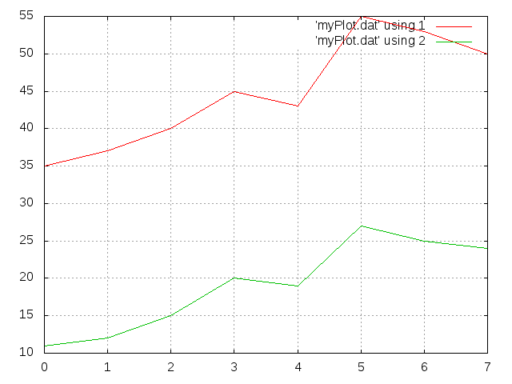

Title: GNU Plot
Date: 2015-02-01 18:59
Author: klasch
Category: IT
Tags: GNUplot, graph
Slug: gnu-plot
Status: published

Heute habe ich mich mal in ein Problemchen verbissen, vor dem ich in der Vergangenheit schon des öfteren halt gemacht hatte - nämlich mit [GnuPlot](http://www.gnuplot.info/ "GnuPlot - Home") mehrere Kurven aus der selben Datei darzustellen; oder noch genauer - die Daten sind als "Spalten" in einer Textdatei mit einem White-Space als Trenner. Hier meine Beispiel-Datei (myData.dat)  
```
35 11
37 12
40 15
45 20
43 19
55 27
53 25
50 24
```
Bei den von mir zu Rate gezogenen Hilfsquellen (Verweise im [Wikipedia-Artikel](http://de.wikipedia.org/wiki/Gnuplot "Wikipedia-Artikel zu GnuPlot") zu [GnuPlot](http://www.gnuplot.info/ "GnuPlot - Home") wurde immer nur schön erklärt, wie man mehrere mathematische Funktionen in eine Graphik packen kann, aber leider nicht explizit, wie man oben gezeigte Datenreihen als zwei separate Kurven in ein Diagramm zeichnen lassen kann.  
Nun, wie geht das jetzt mit den zwei Kurven in einem Diagramm?  
Dazu muss man wissen, dass jede Kurve nach dem plot-Kommando per Komma getrennt mit all seinen zusätzlichen Eigenschaften aufgeführt werden muss. Hier mein Beispiel:  
```
gnuplot -e "set terminal svg;set grid; plot 'myPlot.dat' using 1 with lines, 'myPlot.dat' using 2 with lines;">myDat.svg 
```
* Der Schalter **-e** erlaubt die Angabe des Plot-Scriptes in der Kommandozeile. D.h. hat man mehr Parameter bzw. Konfigurationsgedöns für einen Plot anzugeben, macht es Sinn diese in eine Datei zu packen, welche dann GnuPlot direkt übergeben werden kann.  
* Die erste Script-Zeile **set terminal svg;** gibt an, dass es sich bei der Ausgabe um das [SVG-Format](http://de.wikipedia.org/wiki/SVG "SVG @ Wikipedia") handelt (Scalable Vector Graphic).  
* Die zweite Script-Zeile **set grid;** bewirkt, dass ein Gitter über das Koordinatensystem gelegt wird.  
* Die dritte Zeile ist nun die wichtigste Zeile - sie gibt an, welche Daten für den Plot verwendet werden sollen, jede Kurve per Komma getrennt.
  * So sagt das Kommando **plot** das etwas gezeichnet werden soll.
  * Danach wird die Quelle für die Daten angegeben - in unserem Fall die Datei **myPlot.dat**.
  * Anschließend erfolgt mittels **using 1** die Angabe, welche Spalte für die Kurve verwendet werden soll.
  * Abschließend wird noch mit **with lines** festgelegt, dass die Punkte mit einer Linie verbunden werden sollen.  
* Die zweite Kurve wird bis auf **using 2** identisch zur ersten Kurve definiert; using 2 gibt an, dass die zweite Spalte der Datei myPlot.dat als Datengrundlage verwendet werden soll.  

Und hier nun das Ergebnis:  

