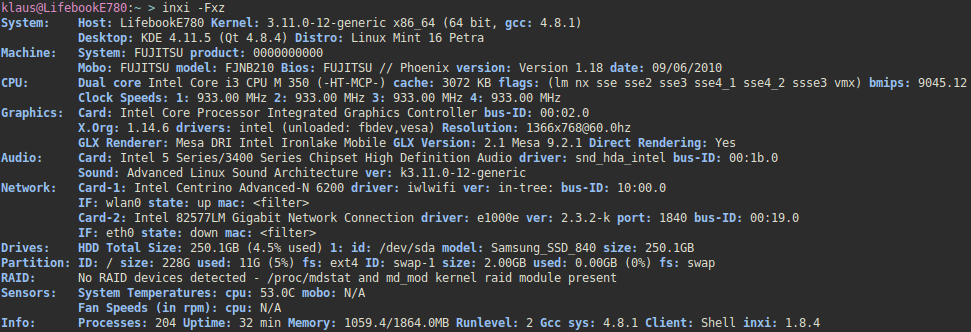
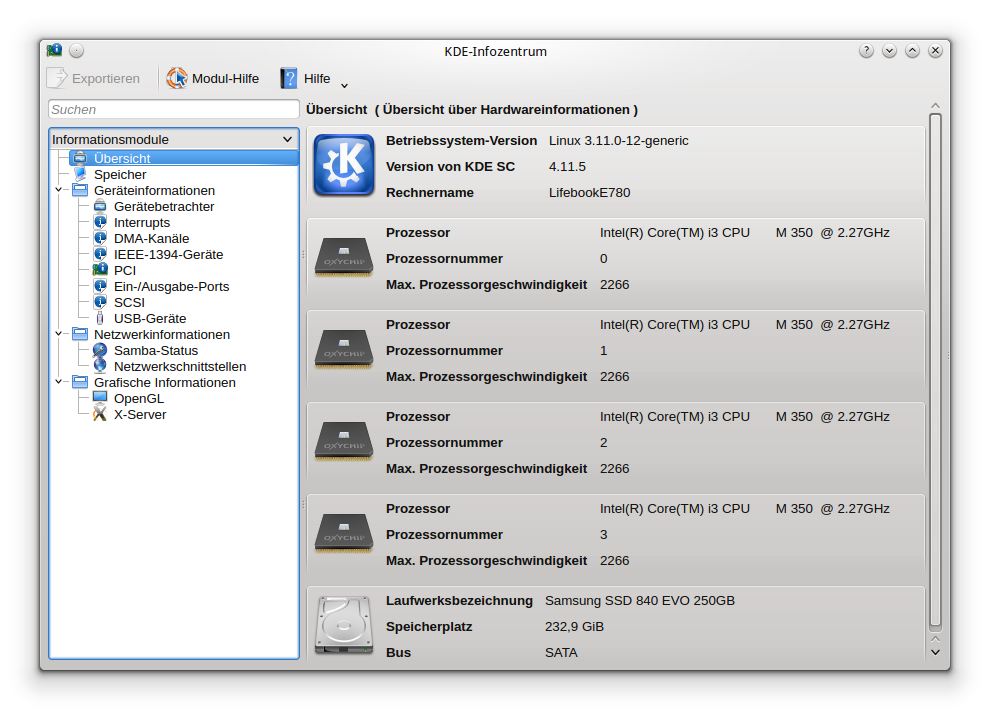

Title: Hardware Informationen unter Linux auslesen
Date: 2014-10-05 09:35
Author: klaus
Category: IT
Tags: computer, linux, systeminfo
Slug: hardware-informationen-unter-linux-auslesen
Status: published

unter Windows kann man ganz einfach mit Hilfe des Programms msinfo32.exe sämtliche Hardware Informationen seines Rechners auslesen und anzeigen lassen. Das geht auch unter Linux. Alles was man dazu braucht ist

    inxi

Falls es noch nicht installiert ist, kann das sehr schnell auf der Kommandozeile nachgeholt werden.

    sudo apt-get install inxi

Ein Aufruf von

    inxi -Fxz

bringt dann z.B. folgende Informationen ans Tageslicht:  

  - Die Option "F" sorgt dafür, dass alle Informationen (**F**ull) ausgegeben werden
  - "x" soll noch für e**X**tra Daten sorgen
  - und "z" soll verhindern, dass Sicherheitsrelevante Daten gezeigt werden - wenn man z.B. seine Hardware-Informationen in einer Newsgroup oder wie ich hier auf einem Blog veröffentlichen will.

Und ja, natürlich gibt es auch ein graphisches Tool, dass sich sehr stark an msinfo32.exe anlehnt. Wer meine Systeminformationen angeschaut hat, der sieht, dass ich KDE benutze. Unter KDE kann man das "kinfocenter" bemühen. Also einfach "Alt + F2" drücken und "kinfocenter" eingeben und schwubs hat man die Hardware-Informationen schön aufbereitet in einem Fensterchen liegen.

