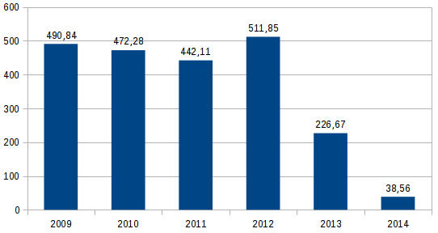
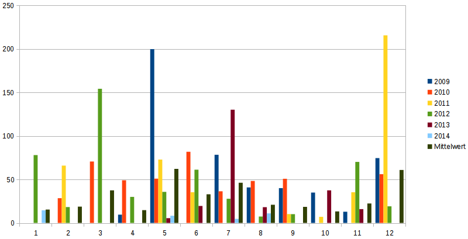

Title: Installierte Solarpower in Fünfstetten
Date: 2015-02-08 18:07
Modified: 2024-04-28 11:55
Author: klasch
Category: Energie
Tags: energie, umwelt
Slug: installierte-solarpower-in-fuenfstetten
Status: published

Wie wohl fast jeder Solaranlagenbesitzer habe ich mit der Jahresabrechnung ein Infoschreiben zum Thema Meldepflicht von Solaranlagen bekommen. Darin war der Verweis auf die [Meldeseite der Bundesnetzagentur](http://www.bundesnetzagentur.de/cln_1432/DE/Sachgebiete/ElektrizitaetundGas/Unternehmen_Institutionen/ErneuerbareEnergien/Photovoltaik/DatenMeldgn_EEG-VergSaetze/DatenMeldgn_EEG-VergSaetze_node.html "Photovoltaikmeldeseite der Bundesnetzagentur")
 jetzt [Marktstammdatenregister](https://www.marktstammdatenregister.de/MaStR).  
Auf dieser Seite bin ich dann auf die Datendateien mit allen Meldungen der letzten Jahre gestoßen und natürlich hat mich die Neugier gepackt und ich habe gleich mal nach den Fünfstetter zahlen geschaut. Die sind darin auch enthalten. Nun war ich nicht mehr zu bremsen, denn als Zahlen-/Daten-Junkie musste ich die Zahlen etwas aufbereiten.  
Tabellarisch sieht das dann so aus:

|        |        |        |        |        |        |       |
| ------ | ------ | ------ | ------ | ------ | ------ | ----- |
|        | 2009   | 2010   | 2011   | 2012   | 2013   | 2014  |
| Jan    | 0.00   | 615.60 | 0.00   | 78.00  | 0.00   | 14.56 |
| Feb    | 0.00   | 28.49  | 65.88  | 18.29  | 0.00   | 0.00  |
| Mär    | 0.00   | 70.61  | 0.00   | 154.16 | 0.00   | 0.00  |
| Apr    | 9.54   | 49.03  | 0.00   | 29.95  | 0.00   | 0.00  |
| Mai    | 199.74 | 50.90  | 72.81  | 35.70  | 5.50   | 8.32  |
| Jun    | 0.00   | 81.77  | 35.33  | 61.18  | 19.51  | 0.00  |
| Jul    | 78.35  | 36.42  | 0.00   | 27.78  | 130.13 | 4.68  |
| Aug    | 40.84  | 48.25  | 0.00   | 7.38   | 18.13  | 11.00 |
| Sep    | 40.00  | 50.76  | 10.20  | 10.14  | 0.00   | 0.00  |
| Okt    | 34.91  | 0.00   | 7.05   | 0.00   | 37.50  | 0.00  |
| Nov    | 12.90  | 0.00   | 35.28  | 70.16  | 15.90  | 0.00  |
| Dez    | 74.56  | 56.05  | 215.56 | 19.11  | 0.00   | 0.00  |
| Gesamt | 490.8  | 1087.9 | 442.1  | 511.8  | 226.7  | 38.6  |

Es zeigt sich wieder einmal, dass ein Bild mehr sagt, als "tausend Zahlen". Wer sich aber die Arbeit macht, die Zahlen mal genauer zu betrachten, dem fällt auf, dass im Januar 2010 ein enormer Peak von sage und schreibe 615,6 kWp eingetragen ist. Dieser Wert kommt von einer einzigen Anmeldung, was den Schluss nahe legt, dass es sich wohl um die Inbetriebnahme der Freiflächenanlage beim Kalköfele handeln muss. Für die graphische Betrachtung der Meldungen lasse ich diese Anlage außen vor, denn das würde dazu führen, dass in den Graphiken ein großer Peak auftaucht und die restlichen Meldungen im "Rauschen" unter gehen.  
Mit den restlichen Zahlen ergibt sich dann über die Jahre folgendes Bild:

_Photovoltaikmeldungen Fünfstetten 2009-2014_

_Photovoltaikmeldungen Fünfstetten 2009-2014 - pro Monat_

Es zeigt sich, dass es 2012 einen Peak gab und seither die Anmeldungen rapide zurückgegangen sind. Dies ist wohl der [Photovoltaik-Novelle im Juni 2012](http://de.wikipedia.org/wiki/Erneuerbare-Energien-Gesetz#Photovoltaik-Novelle_.28Juni_2012.29 "Photovoltaiknoveller 2012") geschuldet - oder es sind ganz einfach keine Dächer mehr frei (wer mit offenen Augen durch Fünfstetten spaziert, wird wohl noch etwas Potential sehen).  
Kommen wir zur Gesamtleistung. Wenn wir das erste Bürgersolarkraftwerk im Süden Fünfstettens mit einer Leistung von 1327.2 kWp, das Solarkraftwerk beim Kalköfele mit 615,6 kWp und die zwischen 2009 und 2014 gemeldeten Photovoltaikanlagen mit einer Leistung von 2182,31 kWp zusammenrechnen, so verfügt Fünfstetten über eine Solarpower von sage und schreibe:  
**4125 kWp** oder auch **4,1 MWp**  
Das ist schon eine Nummer\!  
Trifft man nun eine sehr konservative Annahme mit einer Ertragsleistung von 850 kWh/kWp, so ergibt sich ein Jahresertrag von:  
**3506314,6 kWh** bzw. **3,5 GWh**  
und setzt man dann den [Jahresstromverbrauch eines durchschnittlichen 3-Personen-Haushalts](https://www.stromspiegel.de/stromverbrauch-verstehen/stromverbrauch-3-personen-haushalt/) mit 4000 kWh gegenüber, so könnte man **theoretisch** rund 875 Haushalte damit versorgen.  
[Das bayerische Landesamt für Statistik weiß von Fünfstetten](https://www.statistik.bayern.de/statistikkommunal/09779148.pdf "Statistik von Fünfstetten"), dass es im Jahre 2011 570 Wohnungen in insgesamt 488 Wohngebäuden gab, was wohl deutlich unter den theoretischen 875 Haushalten liegt.  
Und nun höre ich schon die Antagonisten schreien:"ja stimmt vielleicht, aber nur wenn die Sonne scheint". Denen kann man seelenruhig begegnen:"Für die sonnenarmen Tage haben wir ja noch die Biogasanlagen" - aber zu denen habe ich leider keine genauen Zahlen. Außerdem arbeitet die Forschung mit Nachdruck an Speichertechniken und diese werden über die nächsten Jahre auch immer mehr Einzug in die Stromversorgung nehmen. Aber das wäre schon wieder ein eigener Artikel.
