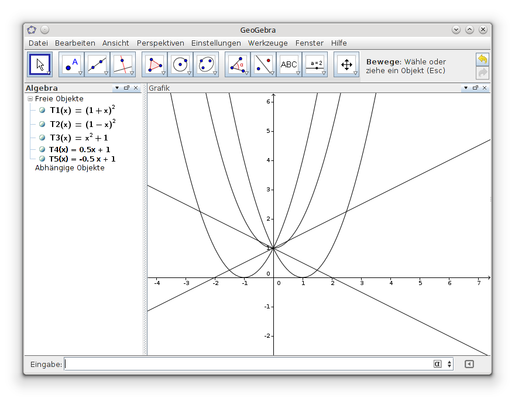

Title: Mathematik-Programm
Date: 2015-02-01 14:47
Modified: 2024-05-01 14:45
Author: klasch
Category: Bildung
Tags: Anwendung, Mathematik, Programm
Slug: mathematik-programm
Status: published

Mit diesem Artikel will ich auf ein Mathe-Programm hinweisen, dass mir auf Anhieb gefallen hat - noch dazu ist es dank Java Cross-Plattform implementiert. 
Es handelt sich um das Programm [Geogebra](http://www.geogebra.org "Geogebra Homepage"). ([Beschreibung in Wikipedia](http://de.wikipedia.org/wiki/Geogebra)).
Dieses kann sowohl direkt im Browser geöffnet (unter dem ''Rechner'' Menü - z.B. Rechner Suite), als auch [Offline-Installation](http://www.geogebra.org/download) herunter geladen werden.

Bild: _[Geogebra](http://www.geogebra.org "Geogebra Homepage") mit ein paar einfachen Thermen_

Das Programm sollte wirklich auf keinem Schüler-PC fehlen. Es erlaubt die dynamische Bearbeitung von geometrischen Figuren/Diagrammen und beherrscht Bereiche aus der Algebra und Analysis. Es gibt auch [deutsche Handbücher](http://wiki.geogebra.org/de/) für den schnellen Einstieg.
Ein weiteres Schmankerl ist, dass man sich nach Anmdeldung auf der Seite mit der Community austauschen und Material hochladen kann.
